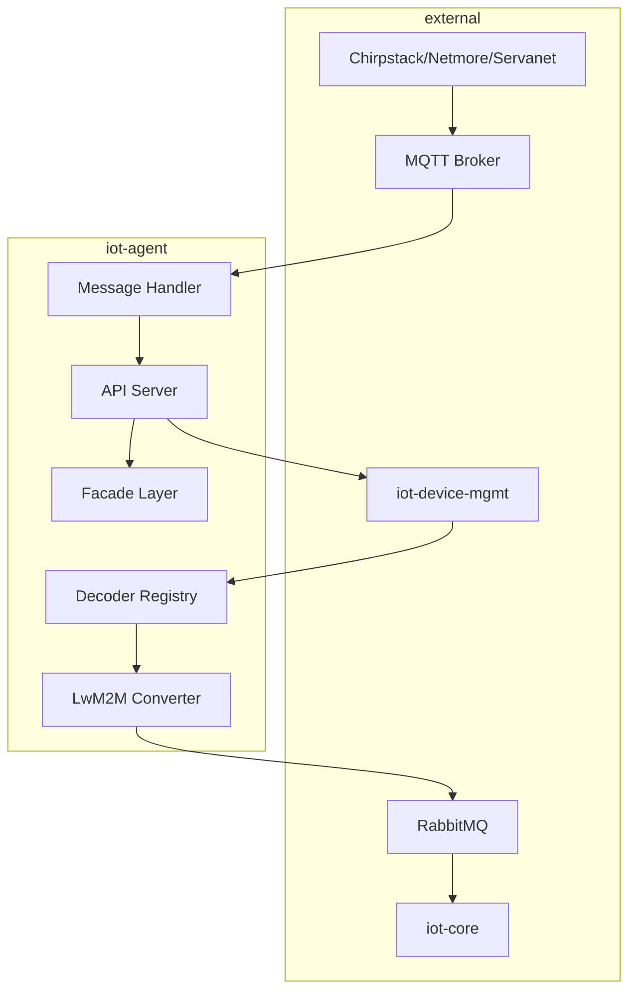

# IoT Agent

A Go service that handles decoding and conversion of incoming IoT sensor data from multiple sources. It processes uplink messages from various LoRaWAN application servers, decodes sensor payloads, and converts them to LwM2M objects for downstream processing.

[](https://github.com/diwise/iot-agent/blob/main/LICENSE)


## Architecture



The IoT Agent follows a modular architecture where:
1. **MQTT Ingestion**: Subscribes to topics from LoRaWAN application servers
2. **Facade Layer**: Normalizes different payload formats to a common internal format
3. **Device Metadata**: Fetches decoder and converter information from iot-device-mgmt
4. **Decoding**: Transforms raw payloads into structured sensor data
5. **Conversion**: Converts sensor data to standardized LwM2M objects
6. **Message Publishing**: Sends converted data via RabbitMQ to downstream services

## Dependencies

- **[iot-device-mgmt](https://github.com/diwise/iot-device-mgmt)** - Device metadata and configuration service
- **[RabbitMQ](https://www.rabbitmq.com/)** - Message broker for downstream communication
- **[PostgreSQL/TimescaleDB](https://www.timescale.com/)** - Data persistence (optional, can run in dev mode)
- **[MQTT Broker](https://mosquitto.org/)** - MQTT message ingestion

## Facades

Different LoRaWAN application servers use varying payload formats. The facade layer normalizes these into a consistent internal format.

### Chirpstack
Support for Chirpstack v3 and v4 application server payloads. Handles standard LoRaWAN uplink messages with device metadata.

### Netmore
Support for payloads from [Netmore IoT Network](https://netmoregroup.com/iot-network/). Includes network-specific metadata and formatting.

### Servanet
Support for Servanet application server payloads with custom message format handling.

## Decoders

The IoT Agent includes decoder implementations for various sensor types and manufacturers. Each decoder transforms raw payload data into structured sensor measurements.

### Air Quality (AX-Sensor)
- PM2.5 and PM10 readings (raw and calibrated)
- Temperature and humidity
- NO2 measurements
- Sensor error status

### Elsys Sensors
Comprehensive support for Elsys LoRaWAN sensors:
- Temperature and External Temperature
- CO2 concentration
- Humidity
- Light intensity
- Motion detection
- Occupancy sensing
- Digital input states and counters
- Battery voltage (Vdd)

**Note**: Uses the [Generic JavaScript decoder](https://www.elsys.se/en/elsys-payload/) specification

### Enviot
- Battery level
- Humidity
- Sensor status
- Snow height
- Temperature

### Milesight AM100
- Temperature
- Humidity
- CO2 concentration
- Battery level

### Niab FLS
Specialized decoder for Niab flow and level sensors

### Qalcosonic Water Meters
Decoder for Ambiductor Qalcosonic W1 series water meters:
- **W1E**
- **W1T**
- **W1H**
- Volume consumption with timestamps
- Temperature readings (W1T variant)
- Device status and error codes

### Senlab T
Temperature sensor decoder
- Temperature measurements

### Sensative
Multi-function sensor decoder supporting:
- Battery level monitoring
- Temperature and humidity
- Door state reports and alarms
- Presence detection

### Sensefarm
Agricultural sensor decoder:
- Battery voltage
- Soil resistance measurements
- Soil moisture levels
- Temperature readings

### Talkpool OY1210
Specialized decoder for Talkpool OY1210 devices

### Vegapuls Air 41
Level measurement sensor decoder

### X2Climate
Climate monitoring sensor decoder

## Converters

Converters transform decoded sensor data into standardized LwM2M objects for interoperability across the IoT ecosystem.

### Supported LwM2M Objects

| Object | Description | LwM2M URN |
|--------|-------------|-----------|
| Air Quality | Air pollution measurements (PM2.5, PM10, NO2) | [urn:oma:lwm2m:ext:3428](https://github.com/OpenMobileAlliance/lwm2m-registry/blob/prod/3428.xml) |
| Conductivity | Electrical conductivity measurements | [urn:oma:lwm2m:ext:3327](https://github.com/OpenMobileAlliance/lwm2m-registry/blob/prod/3327.xml) |
| Digital Input | Binary sensor states and counters | [urn:oma:lwm2m:ext:3200](https://github.com/OpenMobileAlliance/lwm2m-registry/blob/prod/3200.xml) |
| Distance | Distance and level measurements | [urn:oma:lwm2m:ext:3330](https://github.com/OpenMobileAlliance/lwm2m-registry/blob/prod/3330.xml) |
| Humidity | Relative humidity measurements | [urn:oma:lwm2m:ext:3304](https://github.com/OpenMobileAlliance/lwm2m-registry/blob/prod/3304.xml) |
| Illuminance | Light intensity measurements | [urn:oma:lwm2m:ext:3301](https://github.com/OpenMobileAlliance/lwm2m-registry/blob/prod/3301.xml) |
| People Count | Occupancy and people counting | [urn:oma:lwm2m:ext:3434](https://github.com/OpenMobileAlliance/lwm2m-registry/blob/prod/3434.xml) |
| Presence | Motion and presence detection | [urn:oma:lwm2m:ext:3302](https://github.com/OpenMobileAlliance/lwm2m-registry/blob/prod/3302.xml) |
| Pressure | Atmospheric pressure measurements | [urn:oma:lwm2m:ext:3323](https://github.com/OpenMobileAlliance/lwm2m-registry/blob/prod/3323.xml) |
| Temperature | Temperature measurements | [urn:oma:lwm2m:ext:3303](https://github.com/OpenMobileAlliance/lwm2m-registry/blob/prod/3303.xml) |
| Water Meter | Water consumption and flow measurements | [urn:oma:lwm2m:ext:3424](https://github.com/OpenMobileAlliance/lwm2m-registry/blob/prod/3424.xml) |

### Custom Converters
Each sensor type has a dedicated converter that maps the decoded measurements to the appropriate LwM2M object instances, ensuring standardized data representation across all supported sensors.

## Development

### Prerequisites
- Go 1.25 or higher
- Docker and Docker Compose
- PostgreSQL (optional, for production mode)

### Building

#### Local Build
```bash
go mod download
go build -o bin/iot-agent ./cmd/iot-agent
```

#### Docker Build
```bash
docker build -f deployments/Dockerfile -t diwise/iot-agent:latest .
```

### Testing

#### Unit Tests
```bash
# Run all tests
go test ./...

# Run tests with coverage
go test -v -cover ./...

# Run tests for a specific decoder
go test -v ./internal/pkg/application/decoders/elsys/
```

#### Integration Test
Test the API endpoint with a sample payload:

```bash
curl -X POST http://localhost:8080/api/v0/messages \
     -H "Content-Type: application/json" \
     -d '{
            "deviceName": "mcg-ers-co2-01",
            "deviceProfileName": "ELSYS",
            "deviceProfileID": "0b765672",
            "devEUI": "a1b2c3d4e5f6",
            "data": "AQDuAhYEALIFAgYBxAcONA==",
            "object": {
                "co2": 452,
                "humidity": 22,
                "light": 178,
                "motion": 2,
                "temperature": 23.8,
                "vdd": 3636
            }
        }'
```

### Development Environment

#### Dev Mode
Run without external dependencies using the dev mode flag:
```bash
./bin/iot-agent -devmode=true
```

#### Docker Compose
Start the full development environment:
```bash
docker-compose -f deployments/docker-compose.yaml up -d
```

This includes:
- TimescaleDB for persistence
- Mosquitto MQTT broker
- RabbitMQ message broker

### Code Quality
The project uses standard Go tooling for code quality:
- `go fmt` for formatting
- `go vet` for static analysis
- Unit tests with the standard testing package

## Configuration

### Environment Variables

#### Core Service
```bash
# Service Configuration
SERVICE_PORT=8080
LISTEN_ADDRESS=0.0.0.0
CONTROL_PORT=8000

# Development Mode
DEVMODE=false
```

#### MQTT Configuration
```bash
# MQTT Broker Connection
MQTT_DISABLED=<true/false>
MQTT_HOST=<host>
MQTT_PORT=1883
MQTT_USER=<username>
MQTT_PASSWORD=<password>

# MQTT Topics (supports multiple topics)
MQTT_TOPIC_0=application/+/device/+/event/up
MQTT_TOPIC_1=topic-02/#
# Add more topics as needed: MQTT_TOPIC_n=topic-n/#
```

#### RabbitMQ Configuration
```bash
RABBITMQ_HOST=<host>
RABBITMQ_PORT=5672
RABBITMQ_VHOST=/
RABBITMQ_USER=<username>
RABBITMQ_PASS=<password>
RABBITMQ_DISABLED=<true/false>
```

#### Database Configuration
```bash
# PostgreSQL/TimescaleDB
POSTGRES_HOST=<host>
POSTGRES_PORT=5432
POSTGRES_DBNAME=diwise
POSTGRES_USER=<username>
POSTGRES_PASSWORD=<password>
POSTGRES_SSLMODE=disable
```

#### Device Management
```bash
# iot-device-mgmt Service
DEV_MGMT_URL=http://iot-device-mgmt:8080
OAUTH2_TOKEN_URL=http://keycloak:8080/realms/diwise-local/protocol/openid-connect/token
OAUTH2_CLIENT_ID=diwise-devmgmt-api
OAUTH2_CLIENT_SECRET=<your-client-secret>
```

#### Application Server Configuration
```bash
# Facade Selection
APPSERVER_FACADE=servanet  # Options: chirpstack, netmore, servanet

# Message Forwarding
MSG_FWD_ENDPOINT=http://iot-agent:8080/api/v0/messages
```

#### Device Auto-Creation
```bash
# Auto-create unknown devices
CREATE_UNKNOWN_DEVICE_ENABLED=false
CREATE_UNKNOWN_DEVICE_TENANT=default
```

### CLI Flags

```bash
-policies string
    Path to authorization policy file (default "/opt/diwise/config/authz.rego")
    
-deviceprofiles string
    Path to device profile configuration file (default "/opt/diwise/config/deviceprofiles.yaml")
    
-devmode
    Enable development mode with mock dependencies
```

### Configuration Files

#### Device Profiles (`/opt/diwise/config/deviceprofiles.yaml`)
Configuration for automatic device creation when unknown devices are detected:

```yaml
# Example configuration for creating new sensors
Elsys_Codec:
  profile_name: elsys
  tenant: default
  activate: true
  location: true
  tags:
    enabled: true
    metadata: true
    mappings:
      location: plats
      mount: position
```

#### Authorization Policies (`/opt/diwise/config/authz.rego`)
OPA policies for API access control.

## Deployment

-

### Health Checks
The service exposes health check endpoints:
- **Liveness**: `/healthz` - Service is running
- **Readiness**: `/readyz` - Service is ready to accept traffic
- **Component Status**: `/readyz?verbose` - Status of dependencies (RabbitMQ, TimescaleDB, MQTT)

### Monitoring and Observability

#### Metrics
The service exposes Prometheus metrics on the control port (default 8000):
- Message processing metrics
- Decoding error rates
- Component health status

#### Tracing
OpenTelemetry tracing is enabled for distributed tracing of message flows.

#### Logging
Structured JSON logging with configurable log levels.

## API Reference

### Endpoints

#### POST `/api/v0/messages`
Accepts IoT uplink messages for processing.

**Request Body:**
```json
{
  "deviceName": "string",
  "deviceProfileName": "string", 
  "deviceProfileID": "string",
  "devEUI": "string",
  "data": "base64-encoded-payload"
}
```

#### GET `/api/v0/health`
Service health status.

## Contributing

1. Fork the repository
2. Create a feature branch
3. Add tests for new functionality
4. Ensure all tests pass
5. Submit a pull request

### Adding New Decoders

1. Create a new package in `internal/pkg/application/decoders/`
2. Implement the `DecoderFunc` and `ConverterFunc` interfaces
3. Register the decoder in `internal/pkg/application/decoders/registry.go`
4. Add comprehensive tests

### Code Standards
- Follow Go formatting conventions (`go fmt`)
- Write unit tests with good coverage
- Use structured logging
- Add OpenTelemetry instrumentation

## Links

- [IoT Agent Documentation](https://diwise.github.io/)
- [LwM2M Object Registry](https://github.com/OpenMobileAlliance/lwm2m-registry)
- [Diwise IoT Platform](https://github.com/diwise)

## License

This project is licensed under the AGPL v3 License - see the [LICENSE](LICENSE) file for details.
