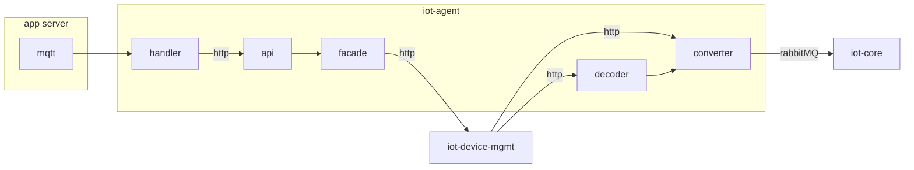

# iot-agent

A service that handles (decodes and converts) incoming data from multiple sources.

[](https://github.com/diwise/iot-agent/blob/main/LICENSE)

# Design


```mermaid
flowchart LR
    mqtt-->handler
    converter--rabbitMQ-->iot-core
    facade--http-->iot-device-mgmt
    iot-device-mgmt--http-->decoder
    iot-device-mgmt--http-->converter
    subgraph app server
        mqtt
    end
    subgraph iot-agent
        handler--http-->api
        api-->facade
        decoder-->converter
    end 
```

Iot-Agent gets sensor uplink messages on subscribed mqtt-topics exposed by application servers. Messages are handled and POSTed to `/api/v0/messages`, which is an local http endpoint. 
Metadata about the sensor is fetched from iot-device-mgmt, this metadata contains information about which decoder to use to decode the message payload. The metadata also contains information about the converters to use for measurements. 

## Dependencies  
 - [iot-device-mgmt](https://github.com/diwise/iot-device-mgmt)
 - [RabbitMQ](https://www.rabbitmq.com/)

# Facades

Since application servers such as [Chirpstack](https://www.chirpstack.io/application-server/) has different uplink payloads a facade is used to transform the specific payload into an internal format.

### Chirpstack

Support for Chirpstack v3 payloads.

### Chirpstack v4

Support for Chirpstack v4 payloads (`APPSERVER_FACADE=chirpstackv4`).

### Netmore

Support for payloads from [netmore](https://netmoregroup.com/iot-network/)

### Servanet
...

# Decoders
Decoder implementations for sensors

### Presence
[]() Uses codec for Sensative
### Qalcosonic
Decoder for Ambiductor Qalcosonic w1 water meters (w1e, w1t, w1h).
 - Volume (incl. timestamp)
 - Temperature (w1t)
 - Status (codes & messages)
### Elsys
 - Temperature         
 - ExternalTemperature 
 - Vdd                 
 - CO2                 
 - Humidity            
 - Light               
 - Motion              
 - Occupancy           
 - DigitalInput        
 - DigitalInputCounter 

Depends on the [Generic Javascript decoder](https://www.elsys.se/en/elsys-payload/)

### Enviot
 - Battery     
 - Humidity    
 - SensorStatus
 - SnowHeight  
 - Temperature 
### Milesight
 - Temperature
 - Humidity   
 - CO2        
 - Battery    
### Senlab
 - Temperature
### Sensative
 - BatteryLevel
 - Temperature
 - Humidity
 - DoorReport
 - DoorAlarm
 - Presence
### Sensefarm
- BatteryVoltage 
- Resistances    
- SoilMoistures  
- Temperature    

# Converters
Converters converts sensor data to lwm2m measurements.
### AirQuality   
[urn:oma:lwm2m:ext:3428](https://github.com/OpenMobileAlliance/lwm2m-registry/blob/prod/3428.xml)
### Conductivity 
[urn:oma:lwm2m:ext:3327](https://github.com/OpenMobileAlliance/lwm2m-registry/blob/prod/3327.xml)
### DigitalInput
[urn:oma:lwm2m:ext:3200](https://github.com/OpenMobileAlliance/lwm2m-registry/blob/prod/3200.xml)
### Distance
[urn:oma:lwm2m:ext:3330](https://github.com/OpenMobileAlliance/lwm2m-registry/blob/prod/3330.xml)
### Humidity
[urn:oma:lwm2m:ext:3304](https://github.com/OpenMobileAlliance/lwm2m-registry/blob/prod/3304.xml)
### Illuminance
[urn:oma:lwm2m:ext:3301](https://github.com/OpenMobileAlliance/lwm2m-registry/blob/prod/3301.xml)
### PeopleCount
[urn:oma:lwm2m:ext:3434](https://github.com/OpenMobileAlliance/lwm2m-registry/blob/prod/3434.xml)
### Presence
[urn:oma:lwm2m:ext:3302](https://github.com/OpenMobileAlliance/lwm2m-registry/blob/prod/3302.xml)
### Pressure
[urn:oma:lwm2m:ext:3323](https://github.com/OpenMobileAlliance/lwm2m-registry/blob/prod/3323.xml)
### Temperature
[urn:oma:lwm2m:ext:3303](https://github.com/OpenMobileAlliance/lwm2m-registry/blob/prod/3303.xml)
### Watermeter
[urn:oma:lwm2m:ext:3424](https://github.com/OpenMobileAlliance/lwm2m-registry/blob/prod/3424.xml)

# Build and test
## Build
```bash
docker build -f deployments/Dockerfile -t diwise/iot-agent:latest .
```
## Verify
```bash
gofmt -l cmd/ internal/ pkg/
go test -count=1 ./...
go vet ./...
go build ./...
```
## Test
```bash
curl -X POST http://localhost:8080/api/v0/messages 
     -H "Content-Type: application/json"
     -d '{
            "deviceName": "mcg-ers-co2-01",
            "deviceProfileName": "ELSYS",
            "deviceProfileID": "0b765672",
            "devEUI": "a1b2c3d4e5f6",
            "data": "AQDuAhYEALIFAgYBxAcONA==",
            "object": {
                "co2": 452,
                "humidity": 22,
                "light": 178,
                "motion": 2,
                "temperature": 23.8,
                "vdd": 3636
            }
        }'
```

# Configuration
## Environment variables
```json
"MQTT_DISABLED": "false", # enable/disable mqtt input 
"MQTT_HOST": "<broker hostname>",
"MQTT_PORT": "<broker port number>",
"MQTT_USER": "<username>",
"MQTT_PASSWORD": "<password>",
"MQTT_SESSION_MODE": "ephemeral", # ephemeral or durable
"MQTT_CLIENT_ID": "<optional stable client id>", # required for durable, optional for ephemeral
"MQTT_TOPIC_0": "topic-01/#", # configure mqtt topic names
"MQTT_TOPIC_1": "topic-02/#", # it is possible to specify multiple topics
...
"MQTT_TOPIC_n": "topic-n/#",
"RABBITMQ_HOST": "<rabbit mq hostname>",
"RABBITMQ_PORT": "5672",
"RABBITMQ_VHOST": "/",
"RABBITMQ_USER": "user",
"RABBITMQ_PASS": "bitnami",
"RABBITMQ_DISABLED": "false",
"DEV_MGMT_URL": "http://iot-device-mgmt:8080", 
"SERVICE_PORT": "<custom service port, default 8080>",
"MSG_FWD_ENDPOINT" : "http://iot-agent:8080/api/v0/messages",
"OAUTH2_TOKEN_URL": "http://keycloak:8080/realms/diwise-local/protocol/openid-connect/token",
"OAUTH2_CLIENT_ID": "diwise-devmgmt-api",
"OAUTH2_CLIENT_SECRET": "<client secret>",
"APPSERVER_FACADE": "servanet" # configure application server, e.g. chirpstack, netmore or servanet (default)
```

## CLI flags
 - `deviceprofiles` - A device profile configuration file (overrides the `deviceprofiles.yaml` default path)
 - `devmode` - Enable dev mode (in-memory storage and device management mock)
 - `loglevel` - Set the log level (overrides `LOG_LEVEL`)

The dead `policies` flag (`POLICIES_FILE`) was removed in AGENT-003: the file was never opened and no OPA policy is used by this service. External calls passing `-policies` are now rejected at startup.

## Configuration files
 - `deviceprofiles.yaml` (default `/opt/diwise/config/deviceprofiles.yaml`) - Required at startup, maps device profiles to decoders/converters.

## Faktisk konfiguration (kod ar facit, HARM-002)
Precedens: default < miljovariabel < CLI-flagga.

| Variabel | Default | Notering |
| --- | --- | --- |
| `LISTEN_ADDRESS` | `0.0.0.0` | Galler bade publik server och kontrollserver |
| `SERVICE_PORT` | `8080` | Publik server (`POST /api/v0/messages`, `POST /api/v0/messages/lwm2m`, `/openapi.yaml`, `/docs`) |
| `CONTROL_PORT` | `8000` | Kontrollserver: pprof, liveness, readiness-stubbar (`rabbitmq`, `timescale`, `mqtt`) som returnerar OK |
| `LOG_LEVEL` | `debug` | `debug`, `info`, `warn`, `error`; okant varde faller tillbaka till `debug` |
| `POSTGRES_HOST` | (tom) | Anvands via `storage.LoadConfiguration` |
| `POSTGRES_PORT` | `5432` | Se ovan |
| `POSTGRES_DBNAME` | `diwise` | Se ovan |
| `POSTGRES_USER` | (tom) | Se ovan |
| `POSTGRES_PASSWORD` | (tom) | Se ovan |
| `POSTGRES_SSLMODE` | `disable` | Se ovan |
| `CREATE_UNKNOWN_DEVICE_ENABLED` | `false` |  |
| `CREATE_UNKNOWN_DEVICE_TENANT` | `default` |  |
| `MSG_FWD_ENDPOINT` | `http://127.0.0.1/api/v0/messages` | Intern MQTT-forwarder mot eget API |
| `APPSERVER_FACADE` | `servanet` | `chirpstack`, `chirpstackv4`, `netmore`, `servanet`; okant varde faller tillbaka till `chirpstack` |
| `DEV_MGMT_URL` | (tom) | Klient mot iot-device-mgmt |
| `OAUTH2_TOKEN_URL` | (tom) |  |
| `OAUTH2_CLIENT_ID` | (tom) |  |
| `OAUTH2_CLIENT_SECRET` | (tom) |  |
| `MQTT_DISABLED` | `false` | `true` stanger av MQTT-ingress |
| `MQTT_HOST` | (tom, kravs) | Broker hostname |
| `MQTT_PORT` | `8883` |  |
| `MQTT_USER` | (tom) |  |
| `MQTT_PASSWORD` | (tom) |  |
| `MQTT_CLIENT_ID` | (tom) | Kravs vid durable session |
| `MQTT_SESSION_MODE` | `ephemeral` | `ephemeral` eller `durable` |
| `MQTT_TOPIC_0..24` | (tom, minst en kravs) | T.ex. `MQTT_TOPIC_0=topic-01/#` |
| `MQTT_KEEPALIVE` | `30` | Sekunder |
| `RABBITMQ_HOST` | (tom, kravs om inte avstangd) |  |
| `RABBITMQ_PORT` | `5672` |  |
| `RABBITMQ_VHOST` | `/` |  |
| `RABBITMQ_USER` | `user` |  |
| `RABBITMQ_PASS` | `bitnami` |  |
| `RABBITMQ_DISABLED` | `false` |  |
| `RABBITMQ_INIT_TIMEOUT` | `10` | Sekunder |
| `POSTGRES_MAX_CONNS` | `10` |  |
| `POSTGRES_MIN_CONNS` | `2` |  |
| `POSTGRES_MAX_CONN_LIFETIME` | `30m` |  |
| `POSTGRES_MAX_CONN_IDLE_TIME` | `5m` |  |
| `POSTGRES_HEALTH_CHECK_PERIOD` | `30s` |  |

RabbitMQ konfigureras i ovrigt via `messaging.LoadConfiguration`. Poolvarden ovan tolkas av den laste `service-chassis`-versionens env-hjalpare.

Health paths pa kontrollservern (`CONTROL_PORT`): `/health`, `/healthz`, `/livez`, `/readyz`, `/readyz/{check}`.

Externa Kubernetes- och Compose-definitioner finns inte i detta repo och ar darfor inte inventerade har.

# Links
[iot-agent](https://diwise.github.io/) on diwise.github.io
